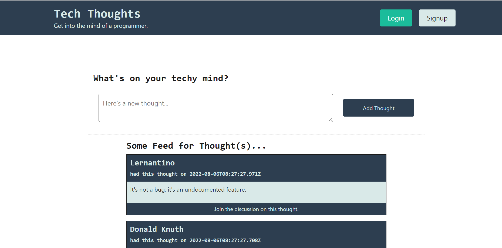
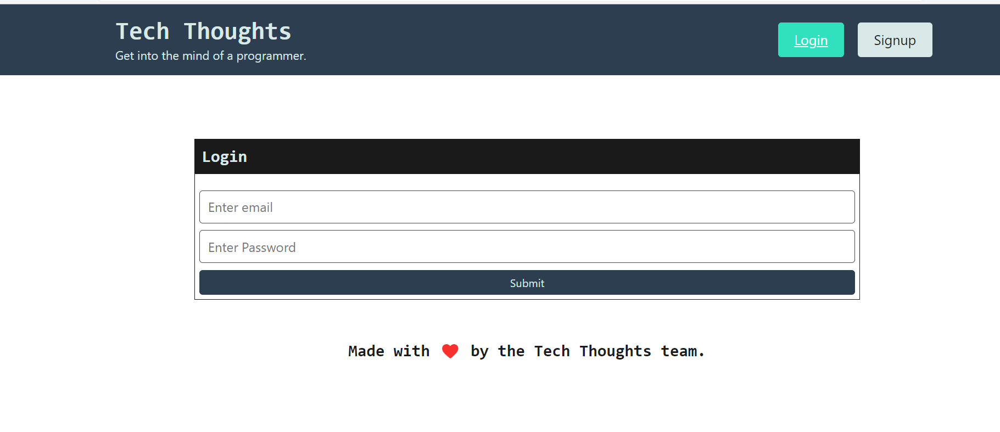
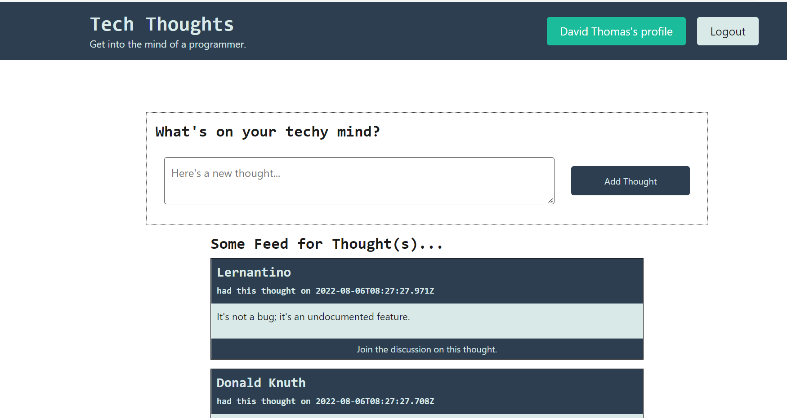

# ThoughtsBlog
## Table of Contents

- [Description](#description)
- [Installation](#installation)
- [Usage](#usage)
- [Login](#login)
- [Image](#image)
- [Repository](#repository)
- [Production](#production)
- [Contributing](#contributing)
- [Questions](#questions)

## Description

Its an app which is a blog user can share their thoughts and others can comment the thought.Its built in Mean stack.

## Installation

`npm init`

`npm i`

`npm run install`

`npm run seed`

## Usage

Run the following command at th root of your project and check the app

`npm run develop`

## Login

Public user type login detail
username : bkernighan@techfriends.dev
password : password01

## Contributing

[Vinitha Gowtheepan](https://github.com/sreevinithaa)

## Image

## Repository

You can get the code in the following link. https://github.com/sreevinithaa/ThoughtsBlog.git

## Questions

Contact me with any questions: [email](mailto:sreevinithaa@gmail.com) , [GitHub](https://github.com/sreevinithaa) 

